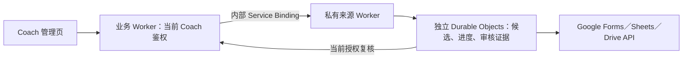

# Cloudflare 私有来源服务设计

状态：已确认，作为当前后台架构。独立私有DO、内部运行接线、云端OAuth、封存备份恢复及显式capture-native证明消费已有实现；真实部署、Google授权和免费资源另按门槛验证。接续位置见[当前进度](../CURRENT-STATUS.md)的私有来源发布、来源审核及年度输出门槛。

## 解决的问题

报名、排座等业务记录只能说明系统当前采用的结果。来源审核还需要保留完整 Google Form 回答、原响应 Sheet 矩阵与 schema、观测时间及摘要，才能解释一条业务记录来自哪里、人工映射依据是什么，以及中断后是否恢复了同一次操作。

私有来源组件负责读取、固定原候选、保存逐请求进度和只追加的人工审核证据。原候选保持不可变，人工审核产生独立派生结果；人工声明不自动证明全部来源完整或授权年度导出。长期运行在独立Cloudflare私有Worker／DO；Node CLI仅用于本地验收和运维，采用仓库外私有文件存储。业务TeamState与私有来源存储分开。

## 托管结构

- 复用现有 Cloudflare 账户，新增独立私有 Worker 与独立 DO namespace。关闭私有 Worker 的公网 routes、workers.dev 和预览访问入口；实际部署后验证外部不可访问。
- 业务 Worker 仅通过明确的 Service Binding 调用。来源 Worker 不接受浏览器自报 actor、绑定、cutoff、generation 或 writer epoch；从业务权威复核当前会话与原操作。Service Binding 本身不替代 Coach 权限检查，读取和追加都需要检查。
- 原回答、候选与审核全文只进入私有存储；业务 TeamState 继续保存业务数据及必要元数据。私有备份单独授权和导出，禁止把原回答加入普通业务备份、日志或公开页面。
- Google OAuth 的client ID／client secret／refresh token由私有Worker secrets注入；刷新固定访问Google token端点，拒绝重定向和超限／无效响应。access token只缓存在DO内存，不进入SQL、业务备份或错误正文；驱逐后重新刷新。首次真实授权、撤销与轮换由Google账号管理者完成，当前只完成适配实现。Coach会话具有有效期，每次操作仍须当前授权。
- 本地Node CLI用于本地验收和运维；云端使用SQLite CAS和平台secrets，复用来源、checkpoint、journal和审核规则，运行配置见[Cloudflare说明](README.md#私有来源运行入口)。

Google原始回答保存在Cloudflare私有存储，访问由当前Coach权限与内部绑定控制；平台管理存储加密密钥。普通业务备份和公开页面不包含原文。

## 验收与部署

状态及有效范围分别由[当前进度](../CURRENT-STATUS.md)和[验证索引](../tests/CURRENT-VERIFICATION.md#来源采集与审核)维护。业务发布、保护包、轮换、独立Recovery及Google配置的依赖顺序只维护在[隔离发布指南](ISOLATED-RECOVERY.md#隔离发布顺序)。已实现的协议不表示真实授权、云端资源或整体来源资格已经通过。

## 免费优先的用量约束

采用 Workers Free 作为部署约束。平台请求、CPU、DO计算时长、SQL行操作／存储、连接和子请求额度会变化，而且在账户内共享；不在设计文档固定一份可能过期的套餐快照。部署前按下方官方依据及当前账户核对，并测量最大真实来源、checkpoint、候选、审核链、索引和备份的全部用量。

本组件按需触发，不为一年几次的任务配置持续轮询、永久 WebSocket 或持续运行的 timer。普通 Worker 保持轻量鉴权与路由；完整来源校验和 CAS 采用私有 DO／有界操作，并测量相应平台的实际 CPU，不能借内部 Service Binding 假定获得新的执行预算。DO 的运行时边界与普通 Worker 不同，依据平台限制单独验收。

当前capture每次最多启动32个新来源请求，在持久STARTED标记前停止；capture-native首次原生观察也计一条并预留两个external槽。重新执行沿已确认checkpoint继续，未决请求拒绝重取。每命令Google API、OAuth和native预留合计最多40次；journal达到预算后由原操作恢复协议核验已写入结果，不自动重试。私有OAuth／直接REST共享deadline并拒绝重定向；原生Apps Script桥在同一20秒deadline内仅接受302／303至script.googleusercontent.com/macros/echo的一次GET，取消body、释放reader并拒绝第二跳。这是当前受控实现边界，真实Google兼容性未验。平台的子请求、连接及CPU限制和最大2MB审核响应仍须隔离实测。

review-view／review-append在本命令第一次完整journal读回成功后，可复用本命令的Google ACL／内容观测；当前Coach、pin、固定目标、本地候选／receipt和审核CAS继续复核，不缓存当前权限。新命令或DO驱逐重新读Google，审核原文只由当前Coach受保护取得。冷OAuth首次view／append的模型外部请求为14／13，已有一条parent时为20／19；这些是模型路径计数，不是生产资源测量。

部署前须复核当前账户仍为 Free、其他服务占用和真实最大来源规模；在免费环境记录完整操作与恢复的 Worker／DO 请求、CPU／duration、SQL rowsRead／rowsWritten 和 databaseSize。免费额度满足且单次限制通过后，才写“免费计划验收通过”。不能为节省用量跳过来源、权限或恢复检查。

Free 超额时操作保持未确认并按原协议恢复，不自行购买或升级。付费套餐、实时账户计划及其他服务占用均在部署前核对，不能将付费包含用量称为免费。

## 当前存储实现

[PrivateSourceSqlStore](source-private/src/store.ts)使用独立SQLite schema1，包含版本表、record manifest和chunk表，不属于业务schema16／51表备份。单条canonical记录最多14 MB，按64 KB UTF8 BLOB拆分；manifest绑定key、revision、总字节数、块数及SHA。完整读回核对数量／次序／尺寸／UTF8／canonical正文与摘要，再由业务组件复核独立来源锚。

命令沿命名 `SourceRuntime.run` → `PrivateSourceState.execute` 执行，前者固定当前业务 pin 与对象名，后者在命令范围内复核当前授权并使用内部 SQLite store。DO 的自定义 RPC 仅提供 `execute`；原始记录读取和 CAS 在存储组件内完成。存储测试通过 `cloudflare:test` 的 `runInDurableObject` 访问真实 SQLite，生产入口不承担测试数据读写。

连续revision CAS在hash异步后再次核对原manifest；旧块替换、全部新块和manifest在同一事务提交，失败整体回滚。损坏、缺块和孤立块拒绝，不覆盖修复。每对象应用记录预算256,000,000字节，实际含索引的databaseSize仍需云端实测。RPC只传成功结果或固定失败回执，不透传依赖错误。有效本地运行时证据见[验证索引](../tests/CURRENT-VERIFICATION.md#来源采集与审核)，实际部署及缺项见当前进度。

私有backup单独授权，最多16,000,000原始字节／128条和23,000,000 encoded字节；超额整对象拒绝，不截断，更大对象分页工具尚缺。RecoveryState是独立封存namespace，恢复不提供业务／Google／cron／alarm或旧session执行。业务51表包排除会话及备份自身，14→16仅升级app_meta schema而新4表为空。业务包／恢复命令最多30,000,000字节，RPC元数据余量、平台限制和实际CPU／内存仍须部署时核验。完整当前协议与固定target／digest配置见[隔离恢复指南](ISOLATED-RECOVERY.md)。

原生Tab证明使用Google官方native关联、Form身份／destination及numeric Tab，独立响应HMAC／nonce／方向／action／当前pin与时间核验；Google前后检查Coach和绑定。capture-native将首次单点观察保存为原checkpoint和v2 candidate，摘要绑定proof／actor／attempt／pin与context，原plan core／hash／pin不变；普通capture及旧候选仍为SERVER_BINDING_DECLARATION_ONLY，不回填证明。当前授权实时复核，回放按原时间区间校验。Google journal仅有core，原生receipt恢复依赖私有DO／完整backup；不提升内层LOCAL内容／映射provenance、SOURCE_NOT_VERIFIED或年度资格。原pin限原actor／request，其他Coach委派尚缺；真实Google及云端流程仍为门槛。完整协议见[新capture消费说明](ISOLATED-RECOVERY.md#新capture消费原生证明)。

## 平台依据

- [Cloudflare Service bindings](https://developers.cloudflare.com/workers/runtime-apis/bindings/service-bindings/)：支持 Worker 内部调用及无公网访问的服务隔离；调用方的 Cloudflare Access 上下文不会自动传给下游，应用授权须明确处理。
- [Durable Objects 数据安全](https://developers.cloudflare.com/durable-objects/reference/data-security/)：存储加密和内部传输加密由平台提供，加密密钥由 Cloudflare 管理；这些机制不替代应用鉴权。
- [Durable Objects 限制](https://developers.cloudflare.com/durable-objects/platform/limits/)：存储条目、CPU 和连接等均有界，部署实现必须按当前套餐和序列化大小验证。
- [Workers 价格](https://developers.cloudflare.com/workers/platform/pricing/)及[执行限制](https://developers.cloudflare.com/workers/platform/limits/)：Free 请求和 CPU 上限、账户付费底价，以及 CPU 和网络等待的区别。
- [Durable Objects 价格](https://developers.cloudflare.com/durable-objects/platform/pricing/)：Free 请求、计算时长、SQLite 存储与行操作额度；免费超额拒绝和空闲休眠计费规则。
